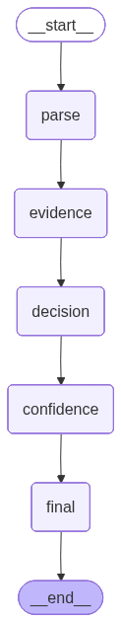

## Usage Notice

This repository is shared for academic, research, and portfolio demonstration purposes only.

No permission is granted to copy, redistribute, commercialize, or reuse substantial portions of this project without explicit written permission from the author.

# NeedLE AI: Agentic RAG System for CMS Medical Coverage Decision Support

## Project Overview

NeedLE AI is a healthcare-focused Retrieval-Augmented Generation (RAG) and agentic AI system designed to assist with CMS National Coverage Determination (NCD) policy interpretation and medical coverage decision support.

The system integrates structured healthcare rules, vector-based policy retrieval, large language models, and LangGraph-based agent workflows to generate grounded and explainable coverage recommendations.

## Key Features

- Healthcare-focused RAG pipeline
- Agentic AI workflow using LangGraph
- CMS NCD policy retrieval
- CPT and ICD-10 validation
- Coverage determination support
- Structured evidence-based responses
- Hallucination mitigation strategies
- Prompt engineering guardrails
- Medical necessity assistance
- Explainable AI outputs

## Technologies Used

- Python
- LangGraph
- LangChain
- OpenAI API
- Vector Embeddings
- Retrieval-Augmented Generation (RAG)
- Healthcare NLP
- Pandas
- Jupyter Notebook

## Why This Project Matters

Healthcare coverage policies are often complex, fragmented, and difficult to interpret manually. This project explores how Retrieval-Augmented Generation (RAG) and agentic AI workflows can support explainable, evidence-grounded healthcare coverage decision support using CMS policy data.

The system combines structured healthcare rule validation with LLM-powered reasoning and retrieval pipelines to improve transparency and reduce hallucinations in healthcare AI responses.

## LangGraph Agent Workflow

The system uses a sequential agentic workflow built with LangGraph to process healthcare coverage questions through structured reasoning stages.

### Workflow Stages

1. **Parse**  
   Extract CPT, ICD-10, date of service, and user intent.

2. **Evidence Retrieval**  
   Retrieve relevant CMS policy evidence and structured coverage mappings.

3. **Coverage Decision**  
   Evaluate medical necessity and policy alignment.

4. **Confidence Assessment**  
   Generate confidence estimation based on evidence quality and rule matching.

5. **Final Response Generation**  
   Produce an explainable, evidence-grounded healthcare coverage response.



## Data Sources

- CMS National Coverage Determination (NCD) Lab Manual
- CMS CPT–ICD Mapping Files
- ICD-10-CM datasets
- Structured CMS policy documents

## Example Query

Question:
Is CPT 84443 covered for ICD-10 E03.9?

Output:
- Coverage Decision
- Supporting Evidence
- Relevant NCD
- Required Documentation
- Confidence Assessment

```markdown id="4kh80r"

## Example Workflow Output

Example coverage workflow:

- User submits CPT and ICD-10 query
- System retrieves CMS policy evidence
- Structured rule validation is performed
- Coverage determination is generated
- Confidence scoring and evidence grounding are applied
- Final explainable response is returned

## Repository Structure

```text
needle-ai-healthcare-rag-system/
│
├── docs/
├── notebooks/
├── sample_outputs/
├── screenshots/
├── README.md
├── requirements.txt
└── .gitignore

## Healthcare Informatics Applications

This project demonstrates:
- Clinical decision support concepts
- Medical necessity workflow automation
- Healthcare policy retrieval
- AI-assisted coverage validation
- Explainable healthcare AI
- Agentic healthcare reasoning systems
